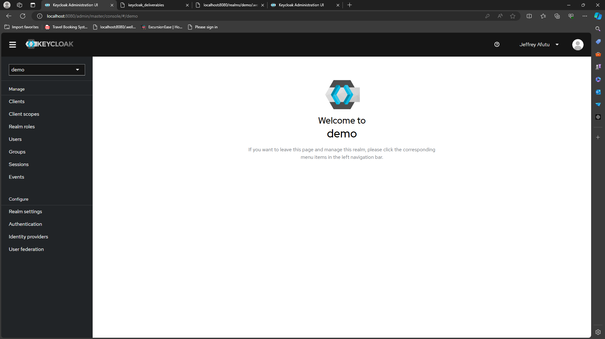
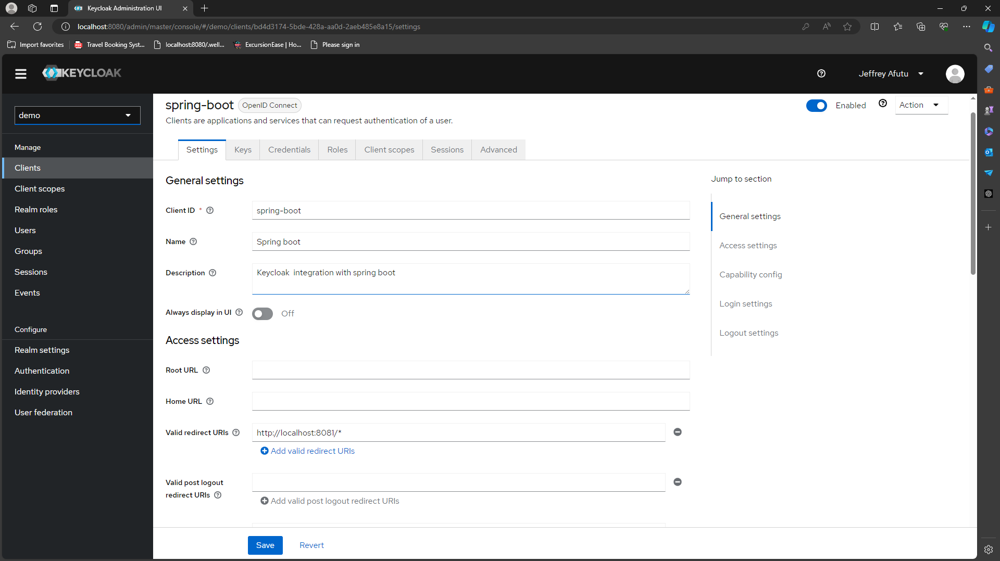
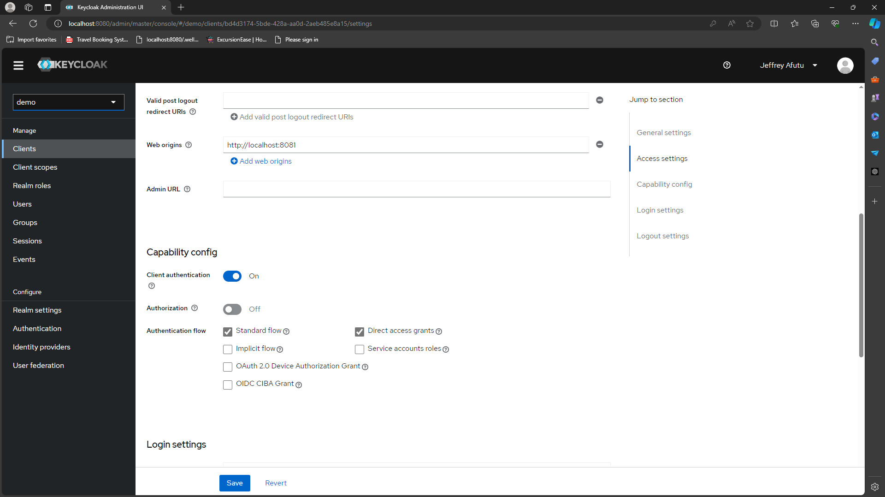

# KEYCLOAK INTEGRATION WITH SPRING BOOT

## USAGE
- Command to start keycloak in docker:
    - Replace admin and admin_password with your credentials.
```
docker run --name keycloak -p 8080:8080 -e KEYCLOAK_ADMIN=<admin> -e KEYCLOAK_ADMIN_PASSWORD=<admin_password> quay.io/keycloak/keycloak:24.0.2 start-dev
```
- After keycloak is running create a realm `demo`

- Create a client `spring-boot`, Valid redirect URIs `http://localhost:8081/*`, Web origins `http://localhost:8081` and ensure you have client authentication on


- Create a user for authentication and authorization into the keycloak server. Ensure you enable email verified


- Optional: Add github or google as an identity provider

  - Ensure when creating oauth app in github or google, use the redirect uri provided by keycloak 
  - After creating the oauth app, provide the client id and client secret to your keycloak

- Access your configuration endpoints at `http://localhost:8080/realms/demo/.well-known/openid-configuration`
  For further information on creating realms and client checkout [Keycloak instructions](https://www.keycloak.org/getting-started/getting-started-docker)
