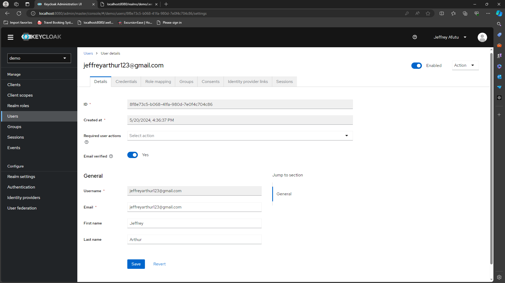
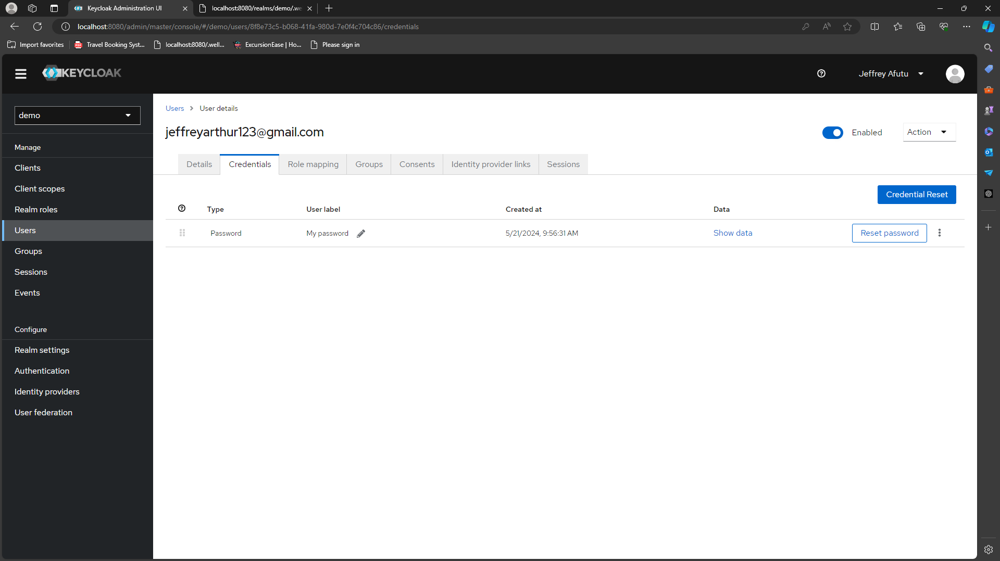
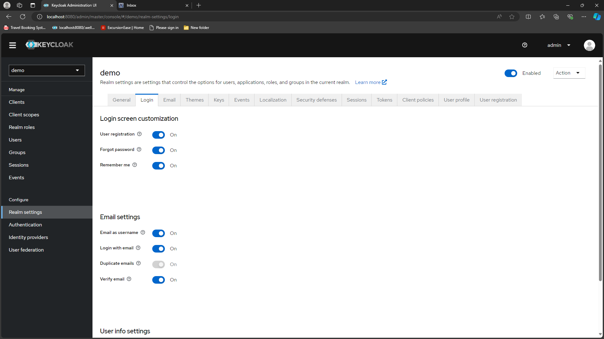
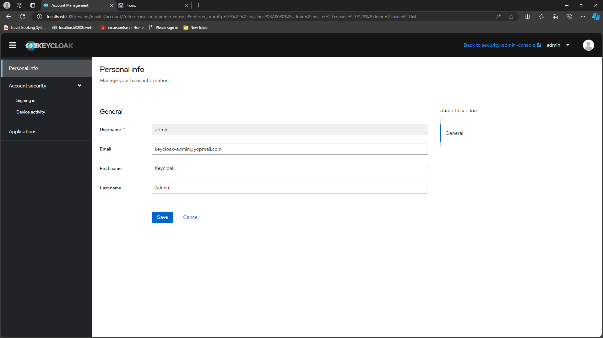
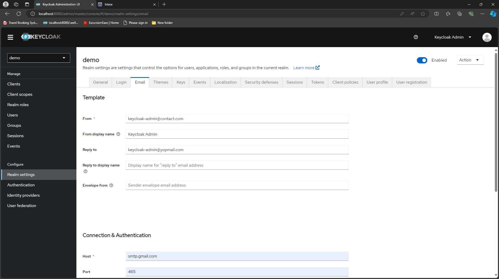
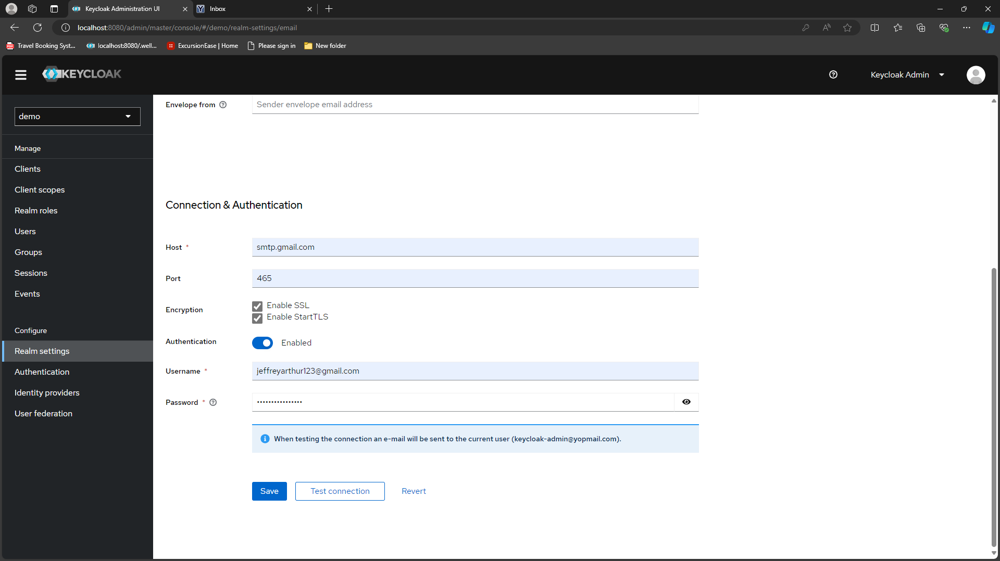
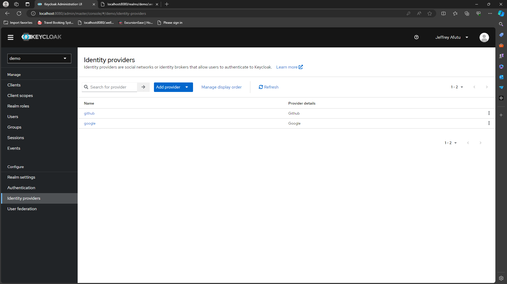
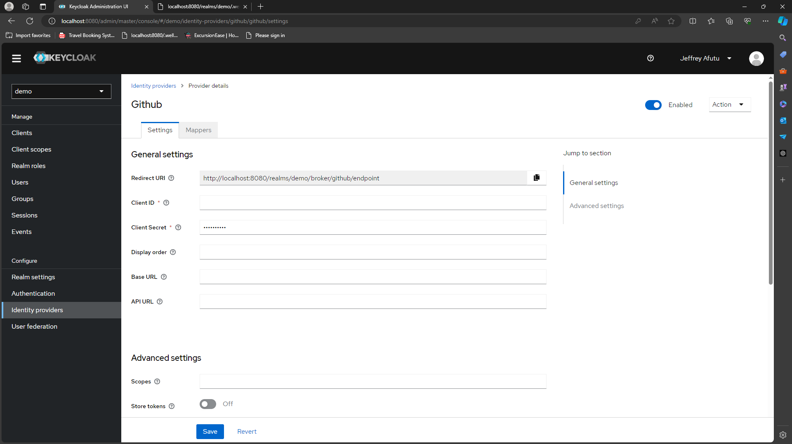

# KEYCLOAK INTEGRATION WITH SPRING BOOT
Configuring keycloak as an authorization server. Follow the steps to create a realm and configure identity providers such as Google and GitHub.

## USAGE
In this project, postgres was used as the database for keycloak.
Keycloak admin credentials are username/email=`admin` and password=`password`.
If you have postgres installed on your computer follow [STEP 1](#step-1) else move to [STEP 2](#step-2) to start keycloak  
In the `application.yml` provide the environment variables for `JWT_SET_URI`, `ISSUER_URI`, `CLIENT_ID` and `CLIENT_SECRET`


### STEP 1
- Create a database `keycloak`.
- In your root folder where you have `docker-compose-keycloak.yml`, modify the command in the keycloak service with your database credentials
- Run
```
docker-compose -f docker-compose-keycloak.yml up
```
- Move to [STEP 3](#step-3)

### STEP 2
- Command to start keycloak and postgres in docker:
```
docker-compose up
```
- Move to [STEP 3](#step-3)

### STEP 3
#### REALM CREATION
- After keycloak is running create a realm `demo`

#### CLIENT CONFIGURATION
- Create a client `spring-boot`, Valid redirect URIs `http://localhost:8081/*`, Web origins `http://localhost:8081` and ensure you have client authentication on


#### USER CREATION
- Create a user for authentication and authorization into the keycloak server. Ensure you enable email verified


#### USER REGISTRATION
- In the `Realm Settings`, configure the login tab as below to allow user registration, password reset, remember me, email as username and email verification.

- Configure admin credentials (email, first name and last name)

- In the `Realm Settings`, configure the email tab as below to send email for verification, password reset etc.



#### IDENTIFY PROVIDERS CONFIGURATION
- Add github or google as an identity provider

  - Ensure when creating oauth app in github or google, use the redirect uri provided by keycloak 
  - After creating the oauth app, provide the client id and client secret to your keycloak

- Access your configuration endpoints at `http://localhost:8080/realms/demo/.well-known/openid-configuration`
  For further information on creating realms and client checkout [Keycloak instructions](https://www.keycloak.org/getting-started/getting-started-docker
